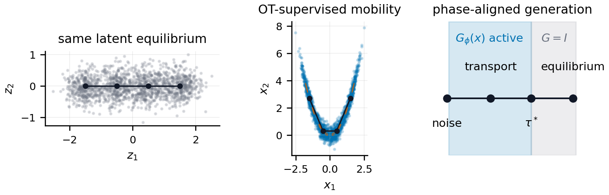

# Riemannian Energy Matching

**Learning transport geometry around a frozen energy model**

Riemannian Energy Matching (REM) keeps a pretrained Energy Matching potential fixed and learns a bounded, determinant-one SPD mobility. The energy continues to define the modeled equilibrium, while the mobility changes how the sampler traverses that energy landscape.



## Method

Given a frozen potential \(V_\theta\) and an OT-supervised velocity \(u_t\), REM learns \(G_\phi(x) \succ 0\) through

```math
u_t \approx -G_\phi(x_t)\nabla V_\theta(x_t),
\qquad
\det G_\phi(x_t)=1.
```

The learned mobility changes transport without changing the scalar energy. At positive temperature, the corrected diffusion is

```math
dX_s =
\left[-G_\phi\nabla V_\theta
+\varepsilon\,\mathrm{div}\,G_\phi\right]ds
+\sqrt{2\varepsilon G_\phi}\,dW_s,
```

which preserves the original Lebesgue-density Boltzmann law

```math
\rho_\infty(x)\propto \exp[-V_\theta(x)/\varepsilon].
```

The repository supports two residual choices under the same mobility parameterization:

```math
\mathcal L_{\mathrm{REM}}(\phi;W)
=\mathbb E\!\left[r_t^\top W_\phi(x_t)r_t\right]
+\lambda_{\mathrm{geo}}\mathbb E\!\left[\|\log G_\phi(x_t)\|_F^2\right],
\qquad
r_t=u_t+G_\phi(x_t)\nabla V_\theta(x_t).
```

- `W = I` is the Euclidean residual used for controlled geometry recovery.
- `W = G_phi^{-1}` is the intrinsic residual used in the image experiments.

## What is implemented

- Pointwise SPD representability constructions and descent-margin diagnostics.
- Identity, constant, scalar, determinant-one diagonal, full-SPD, and diagonal-plus-low-rank mobilities.
- Exact and Hutchinson divergence estimators for corrected Riemannian Langevin dynamics.
- Controlled warped-mixture recovery, first-passage, and stationary-bias experiments.
- Frozen-energy CIFAR-10 and ImageNet32 mobility training and official-protocol evaluation.
- Independent mobility-training and sampling-seed aggregation.
- PEM-inspired residual and learned-mirror representation controls.
- Image mobility diagnostics, including held-out OT residuals, descent margins, log-eigenvalue statistics, and cross-fit consistency.
- Inverse-problem and protein experiment entry points.

## Main results

All image comparisons use the same frozen energy checkpoint and paired sampling streams.

| Dataset | Frozen EM | REM | Change |
|---|---:|---:|---:|
| CIFAR-10 FID | 3.462 ± 0.030 | **3.297 ± 0.009** | −0.165 |
| ImageNet32 FID | 6.742 ± 0.117 | **6.555 ± 0.064** | −0.187 |

Across independent mobility fits, REM reduces held-out Euclidean OT velocity residual by 8.3% on CIFAR-10 and 11.2% on ImageNet32. The learned diagonal fields are also consistent across fits, with cross-fit correlations of 0.895 and 0.904, respectively.

In the controlled nonlinear-warp diagnostic at curvature \(c=1.2\), full REM reaches relative velocity MSE \(0.00108\pm0.00025\) and first passage in \(111\pm14\) steps, compared with \(196\pm75\) steps for identity mobility. Removing the divergence correction produces persistent stationary bias under step-size refinement.

## Repository layout

```text
rem/
  geometry.py       mobility parameterizations and divergence estimators
  sampling.py       deterministic and corrected stochastic samplers
  training.py       OT-supervised mobility objectives
  synthetic.py      analytic warped targets and diagnostics
experiments/
  synthetic/        recovery, first-passage, stationarity, and baselines
  cifar10/           frozen-mobility training and image evaluation
  imagenet/          ImageNet32 dataset and FID-stat utilities
  inverse/           inverse-problem transfer
  proteins/          AAV inference-time experiments
tests/               unit and smoke tests
```

## Installation

The codebase targets Python 3.10 and PyTorch with CUDA.

```bash
conda create -n rem python=3.10 -y
conda activate rem
pip install torch torchvision torchaudio --index-url https://download.pytorch.org/whl/cu118
pip install -r requirements.txt
```

Run the test suite from the repository root:

```bash
PYTHONPATH=. pytest -q
```

## Controlled geometry experiment

Run the warped-mixture recovery and equilibrium-validity suite:

```bash
python -m experiments.synthetic.run_geometry_stress \
  --curvatures 0,0.4,0.8,1.2 \
  --seeds 0,1,2,3,4 \
  --output outputs/geometry_stress
```

The controlled recovery phase directly supervises the analytic pushforward field, allowing the learned tensor to be compared with the known oracle mobility. The validity phase separately tests corrected and uncorrected state-dependent Langevin dynamics.

## Frozen-energy image mobility

Train a determinant-one diagonal mobility around an existing Energy Matching checkpoint:

```bash
python -m experiments.cifar10.train_rem \
  --mode frozen \
  --mobility diagonal \
  --energy-checkpoint /path/to/energy_checkpoint.pt \
  --data-root /path/to/cifar10 \
  --seed 0 \
  --output outputs/cifar10_rem
```

Evaluate a trained checkpoint with the matched phase-gated sampler:

```bash
python -m experiments.cifar10.evaluate_rem \
  --dataset cifar10 \
  --checkpoint /path/to/rem_checkpoint.pt \
  --data-root /path/to/cifar10 \
  --steps 325 \
  --t-end 3.25 \
  --time-cutoff 1.0 \
  --temperature-schedule official \
  --samples 50000 \
  --output outputs/cifar10_eval
```

Use `--no-metric-weighted` during training for the Euclidean-residual ablation. The evaluator also exposes solver, cutoff, mobility-strength, divergence, and sampling-seed controls through `--help`.

## Scope

The full-SPD construction and corrected state-dependent stochastic sampler are evaluated in the controlled low-dimensional setting. Image experiments use scalable determinant-one diagonal mobility during the deterministic transport phase and identity mobility during positive-temperature refinement.

## Upstream attribution

This repository builds on the official [Energy Matching](https://github.com/m1balcerak/EnergyMatching) implementation. Imported code and media retain the upstream MIT license.

```bibtex
@inproceedings{balcerak2025energy,
  title={Energy Matching: Unifying Flow Matching and Energy-Based Models for Generative Modeling},
  author={Balcerak, Michal and Amiranashvili, Tamaz and Terpin, Antonio and Shit, Suprosanna and Bogensperger, Lea and Kaltenbach, Sebastian and Koumoutsakos, Petros and Menze, Bjoern},
  booktitle={Advances in Neural Information Processing Systems},
  volume={38},
  pages={8583--8609},
  year={2025}
}
```
